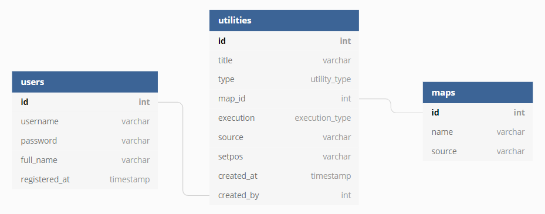

# UngAalborg SmokeCoop

This is a basic website built with PHP + SQL in order to train utilities in CS:GO. Also it is a way for the players to find smokes.


## Todo's

- [x] Create the actual frontpage (Choose map)
  - [x] Add a source to maps database (Link to image)
- [x] More information on the cards (Creator, utility type)
- [x] Colourize tags on cards
- [ ] Make utility cards to flexbox
- [ ] Implement front-end design (Tactical)
- [ ] Default sorting of printing all utilities
- [x] Layout of the modal 
  - [x] Flex box left + right
- [ ] Login + Register system and allow users to add utilities
- [ ] Consider not auto playing on click
- [ ] Searching and sorting options 
  - [ ] Quick search (Query a selection of tables)
    - [ ] Advanced search (Sorting pretty much)
  - [ ] Search by; type, creator, title, 
  - [ ] Sort by; type, creator, date, map area, 
  - [ ] Create layout / design
  - [ ] Decide language to use (Javascript or jQuery)
- [ ] Use .mp4 and proper encoding (ffmpeg)
  - [x] (Modal) Add a video player (Pause, Play, Back and forth) 
  - [x] (Modal) Autoplay the video when clicked on a card.
  - [ ] (Card) Auto generate a thumbnail from the .mp4
  - [x] (Admin-panel) Uploading of .gifs should not be allowed anymore
  - [x] (Overall) Fix folder name: gifs -> videos
  - [x] (Overall) Refractor code where a gif is used to use .mp4 instead.
- [ ] Add colouns to utility table in database
  - [ ] Creator comments, utility tags, setpos
- [ ] Create initial idea or layout of the Practice part


## Brainstorm

### Converting GIFS to MP4

Gifs are large. I want to use something else, otherwise the load time will be huge. MP4 is a commonly used and broadest supported video format on the web. Using **ffmpeg** i can convert .gifs to .mp4 and reduce the size with 90% or more. The command that will be used is;

```ffmpeg -i input.gif -b:v 0 -crf 25 output.mp4```

I still need to determine if its best to record gifs or if I should just record it as mp4. (Which means I wont have to convert it). Also I will need to restructure so that I can show video instead and have a thumbnail generated on my utility card.


### Website structure / design

I wish to have a simple website in which you can choose a map and have all results shown that are associated with the map. Then you can sort which type of utility you wish to have shown. These are created as cards and upon clicking on them a modal is shown in which the .gif is shown. On this panel additional information can also be found.

**Practice part** - Not yet decided.


### Database structure

The first implementation will be simple and easy to work with. The idea is to have users be able to submit utilities. So these link to a user but also a map, because the utility is based on specific maps. The diagram can be found [here.](https://dbdiagram.io/d/5d8caec6ff5115114db4a7af)



